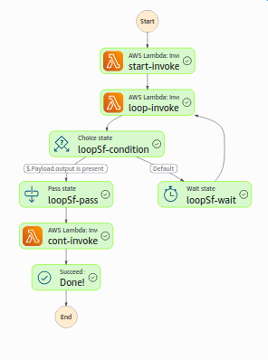

# Stepfunctor

A typed, highly opinionated wrapper about the CDK AwS Step Functions that wants to make
writing step functions as easy as Typescript functions.

## Goals

At a high level this library tries to bridge the gap between AWS Lambda (run time max. 15 minutes) and AWS Batch
(heavy weight service). If you ever have tried to just quickly deploy a longer running Typescript function as
a Step Functors you might have encountered the following issues

- AWS Step Functions have a lot of specialized features, too many to understand them all at once
- basic things like loops are not implemented at all
- the interface between is untyped and adapted using json path
- in particular passing state between tasks is hard: it has to be passed as an argument, yet there
  is no way to type the state
- for the unexperienced user it is very likely that compiling code fails during deploy time

## Non-Goals

- implement all step function features, in particular implement special steps that can be easily implemented as a
  Lambda task
- handle cyclic operations (any application can be and is modelled tree-like)

## Example

A full example is implemented in the `example-` pachages. We present the essentials here:

First define your step function:

```typescript
import { final, loopWhile, prepend } from 'stepfunctor-lang';

async function start() {
  return { s: 'Hello, world!' };
}

async function loop(input: {
  s: string;
}): Promise<{ s: string; output?: { s: string } }> {
  return {
    s: input.s.substring(0, input.s.length - 1),
    output: input.s.length > 1 ? undefined : { s: input.s },
  };
}

async function cont(_: { s: string }): Promise<void> {
  console.log('done');
}

const loopSf = loopWhile(
  loop,
  'loop',
  prepend('cont', cont, final('Done!')),
  5,
);

export const sf = prepend('start', start, loopSf);
```

THen export the handler functions in your npm package for the lambda code

```typescript
import { sf } from 'example-shared';
import { exportStepFunction } from 'stepfunctor-lang';

exportStepFunction(sf, module);
```

Finally, build your cdk app to deploy the infrastructure:

```typescript
import { App, Stack } from 'aws-cdk-lib';
import { Construct } from 'constructs';
import { sf } from 'example-shared';
import path from 'path';
import { buildStepFunctionConstruct } from 'stepfunctor-infra';

class ExampleStack extends Stack {
  constructor(scope: Construct) {
    super(scope, 'myStack');
    buildStepFunctionConstruct(
      sf,
      {
        moduleName: 'index',
        artifactPath: path.join(
          __dirname,
          '../../../packages/example-lambda/dist/',
        ),
        scope: this,
      },
      'MyStepFunction',
    );
  }
}

const app = new App();
new ExampleStack(app);
```

The result will look like this:



## License

This project is licensed under Apache 2.0 or MIT license.
