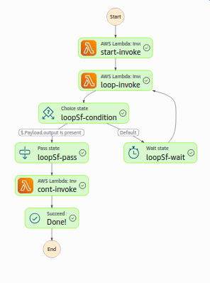
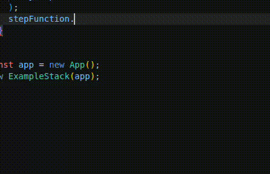

# Stepfunctor

A typed, highly opinionated wrapper about the CDK AwS Step Functions that wants to make
writing step functions as easy as Typescript functions. Find API documentation
[here](https://torfmaster.github.io/stepfunctor/typedoc/).

## Goals

At a high level this library tries to bridge the gap between AWS Lambda (run time max. 15 minutes) and AWS Batch
(heavy weight service). If you ever have tried to just quickly deploy a longer running Typescript function as
a Step Functors you might have encountered the following issues

- AWS Step Functions have a lot of specialized features, too many to understand them all at once
- basic things like loops are not implemented at all
- the interface between is untyped and adapted using json path
- in particular passing state between tasks is hard: it has to be passed as an argument, yet there
  is no way to type the state
- for the unexperienced user it is very likely that compiling code fails during deploy time

This library attempts to provide you with a specialized strongly typed embedded domain specific languages that
is executed in three different ways:

- `stepfunctor-infra` executes the language to create AWS infrastructure
- `stepfunctor-exec` creates commonjs bundles so your code is executed as an AWS lamdba
- and `stepfunctor-exec` lets you just execute your step function locally for testing

Apart from recursion it lets you define all sensible programs as step functions. Ideally, instead of
developing in the cloud reduces development of step functions to

- write the tests using AWS/nock mocks
- make the tests green
- fixup networking
- add permissions mirroring the AWS mocks you set up
- deploy

## Non-Goals

- implement all step function features, in particular implement special steps that can be easily implemented as a
  Lambda task
- handle cyclic operations (any application can be and is modelled tree-like)

## Example

A full example is implemented in the `example-` packages. We present the essentials here:

First define your step function:

```typescript
import { final, loopWhile, prepend } from 'stepfunctor-lang';

async function start() {
  return { s: 'Hello, world!' };
}

async function loop(input: {
  s: string;
}): Promise<{ s: string; output?: { s: string } }> {
  return {
    s: input.s.substring(0, input.s.length - 1),
    output: input.s.length > 1 ? undefined : { s: input.s },
  };
}

async function cont(_: { s: string }): Promise<void> {
  console.log('done');
}

const loopSf = loopWhile(
  loop,
  'loop',
  prepend('cont', cont, final('Done!')),
  5,
);

export const sf = prepend('start', start, loopSf);
```

THen export the handler functions in your npm package for the lambda code

```typescript
import { sf } from 'example-shared';
import { exportStepFunction } from 'stepfunctor-lang';

exportStepFunction(sf, module);
```

Finally, build your cdk app to deploy the infrastructure:

```typescript
import { App, Stack } from 'aws-cdk-lib';
import { Construct } from 'constructs';
import { sf } from 'example-shared';
import path from 'path';
import { buildStepFunctionConstruct } from 'stepfunctor-infra';

class ExampleStack extends Stack {
  constructor(scope: Construct) {
    super(scope, 'myStack');
    buildStepFunctionConstruct(
      sf,
      {
        moduleName: 'index',
        artifactPath: path.join(
          __dirname,
          '../../../packages/example-lambda/dist/',
        ),
        scope: this,
      },
      'MyStepFunction',
    );
  }
}

const app = new App();
new ExampleStack(app);
```

The result will look like this:



Do your lambdas need more permissions? Nothing is easier than that:



## Getting Started

### Basic Concepts

The `stepfunctor` package consists of three components.

**The language**: The (domain specific) language of step functions is defined by the `stepfunctor-lang` package: It
defines the primitives of step functions

- functions (and their compositions)
- loops
- if expressions
- case expressions

**The lambda artifacts**: This is defined by the `stepfunctor-exec` package. It creates the right javascript artifacts
that can later be referred to by cdk.

**The infrastructure**: This is defined by the `stepfunctor-infra` package. It defines the cdk constructs that
actually deploy the step function to AWS.

### Set up package structure

**Meta observation**: We recommend using a monorepo structure like this repository using a monorepo wrapper like `nx`. This
gives you fine grained controlled over all your artifacts without relying on implicit behavior of `cdk`
(like bundling, executing using `ts-node`).

**Define your step function**: We recommend to define and export your step function in a package `example-shared`.
The most basic step function looks as follows:

```typescript
import { final, prepend } from 'stepfunctor-lang';

export const stepFunction = prepend(
  'name',
  async () => {
    console.log('Hello, world!');
  },
  final('Done!'),
);
```

It just logs "Hello, world!" and then succeeds.

**Test the step function locally**

You can test the execution of your step function locally:

```typescript
import { sf } from 'example-shared';
import { runStepFunction } from 'stepfunctor-exec';

describe('test execution of step function', () => {
  it('works', async () => {
    await runStepFunction(sf, {});
  });
});
```

**Create the javascript artifacts**:

Create a commonjs package `example-lambda` and in your entry point do the following:

```typescript
import { sf } from 'example-shared';
import { exportStepFunction } from 'stepfunctor-exec';

exportStepFunction(sf, module);
```

**Deploy the step function in your cdk app**:

We recommend (in general but in special in this case) the setup from `apps/example-app`:

- a cdk app that is compiled to a static js bundle using `webpack` or another bundler
- executing this cdk app using the following `cdk.json`

```json
{
  "app": "node dist/main.js"
}
```

You can now easily deploy your code

```typescript
import { App, Stack } from 'aws-cdk-lib';
import { Construct } from 'constructs';
import { sf } from 'example-shared';
import path from 'path';
import { buildStepFunctionConstruct } from 'stepfunctor-infra';

class ExampleStack extends Stack {
  constructor(scope: Construct) {
    super(scope, 'myStack');
    buildStepFunctionConstruct(
      sf,
      {
        moduleName: 'index',
        artifactPath: path.join(
          __dirname,
          '../../../packages/example-lambda/dist/',
        ),
        scope: this,
      },
      'MyStepFunction',
    );
  }
}

const app = new App();
new ExampleStack(app);
```

Note that the `artifactPath` depends on the relative location of your artifacts. Also note
that you now have an implicit dependency between the packages `example-app` and
`example-lambda`.

You now can run

```bash
pnpx nx run-many -t build
cd apps/example-app
cdk deploy
```

## License

This project is licensed under Apache 2.0 or MIT license.
